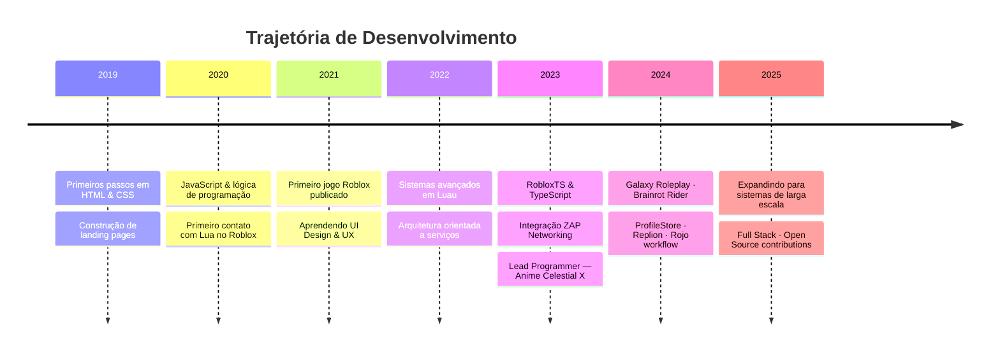

<div align="center">
  
</div>

<div align="center">

[](https://v0-kartzdev.vercel.app/)
[](https://www.roblox.com/users/5285698320/profile)
[](https://www.youtube.com/@Kartz_Dev)
[](https://discord.gg/2QHPTRkQ)
[](mailto:gtofranco1@gmail.com)

</div>

---

## 👨‍💻 Sobre Mim

```luau
local Kartz = {
    nome        = "Mateus Franco",
    idade       = 17,
    localização = "Brasil 🇧🇷",
    experiência = "6 anos",

    origem      = { "Desenvolvimento Web", "Front-end", "Back-end" },
    foco_atual  = "Roblox · Systems Architecture · Full Stack",

    ferramentas = {
        linguagens  = { "Luau", "TypeScript (RobloxTS)", "JavaScript", "HTML/CSS" },
        networking  = { "ZAP", "Networker" },
        dados       = { "ProfileStore", "DataStore2", "Replion" },
        workflow    = { "Rojo", "Git", "VS Code" },
        utilitários = { "Janitor", "Promise", "Signal" },
    },

    arquitetura = "Service-Oriented Architecture (SOA)",
    contato     = "gtofranco1@gmail.com",
}

print(`Olá! Sou {Kartz.nome}, desenvolvedor há {Kartz.experiência}. 🚀`)
```

Sou um **Desenvolvedor Full Stack Brasileiro** com **6 anos de experiência**, que começou no desenvolvimento web (HTML, CSS, JavaScript) e migrou para o ecossistema Roblox, onde atuo como **Systems Architect** — desenhando e implementando sistemas de alta complexidade com foco em performance, escalabilidade e código limpo.

Tenho vivência real em produção: trabalhei como **Lead Programmer** em projetos publicados, incluindo o **Anime Celestial X**, e mantenho projetos próprios ativos na plataforma.

---

## 🛠️ Stack Tecnológica

<div align="center">

### Linguagens


### Roblox Ecosystem


### Ferramentas & Workflow


</div>

---

## ⚡ ZAP — Networking de Alta Performance

> Utilizo o **[ZAP](https://zap.redblox.dev/)** como solução de networking nos meus projetos — uma alternativa ao RemoteEvent tradicional que empacota dados em **buffers binários**, reduzindo drasticamente o overhead de rede e tornando a engenharia reversa do jogo muito mais difícil.

**Vantagens que uso no dia a dia:**
- 📦 **Buffer Packing** — mesmos dados com fração da banda utilizada
- ⚡ **Performance superior** ao encoding genérico do Roblox
- 🔒 **Segurança** — validação automática de todos os dados recebidos do cliente
- 🧑‍💻 **DX excelente** — IDL legível e API intuitiva

```luau
-- Exemplo de definição ZAP (.zap)
-- events.zap
event TakeDamage = {
    from: Server,
    type: Reliable,
    call: SingleSync,
    data: struct {
        target: u16,
        damage: f32,
        source: enum { Bomb, Enemy, Fall },
    },
}

event UpdateCurrency = {
    from: Server,
    type: Reliable,
    call: SingleSync,
    data: struct {
        coins:   u32,
        gems:    u16,
        rebirth: u8,
    },
}
```

---

## 🗄️ Gerenciamento de Dados com ProfileStore

Utilizo uma **arquitetura de dados em camadas** com ProfileStore + Replion para replicação reativa, garantindo persistência segura e sincronização eficiente entre servidor e cliente.

```luau
-- DataService — inicialização e template de dados
local TEMPLATE = {
    coins       = 0,
    gems        = 0,
    rebirth     = 0,
    bomb_stage  = 1,
    island      = 1,
    potions     = {},
    ownedBombs  = {},
    totalDamage = 0,
    joinDate    = 0,
}

function DataService:init()
    self.dataservice:init({
        template         = TEMPLATE,
        profileStoreIndex = "PlayerData_v3",
        useMock          = RunService:IsStudio(),
    })
end

-- Atualização atômica com callback — garante consistência
function DataService:addCoins(player: Player, amount: number)
    self.dataservice:update(player, {"coins"}, function(current)
        return current + amount
    end)
end
```

---

## 🏗️ Arquitetura Orientada a Serviços

Todos os meus projetos seguem uma **SOA (Service-Oriented Architecture)** estrita — cada sistema é encapsulado em um serviço com responsabilidade única, comunicando-se via `networker` e gerenciando seu ciclo de vida com `Janitor`.

```luau
-- BombUpgradeService (Server) — padrão de serviço
local BombUpgradeService = {}
BombUpgradeService.__index = BombUpgradeService

local UPGRADE_COSTS: { [number]: number } = {
    [1] = 0,      [2] = 500,    [3] = 2500,
    [4] = 10000,  [5] = 50000,  [6] = 200000,
    [7] = 750000, [8] = 3000000
}

function BombUpgradeService:init()
    self.networker = networker.server.new("BombUpgrade", self, {
        self.requestUpgrade,
        self.skipWithRobux,
    })
end

function BombUpgradeService:requestUpgrade(player: Player, targetStage: number)
    local data      = self.dataservice:get(player)
    local cost      = UPGRADE_COSTS[targetStage]
    local current   = data.bomb_stage

    -- Validações
    if targetStage ~= current + 1 then return false, "INVALID_STAGE" end
    if data.coins < cost           then return false, "INSUFFICIENT_FUNDS" end
    if not UPGRADE_COSTS[targetStage] then return false, "MAX_STAGE" end

    -- Atualização atômica
    self.dataservice:update(player, {"coins"}, function(c) return c - cost end)
    self.dataservice:update(player, {"bomb_stage"}, function() return targetStage end)

    self.networker:fire(player, "RefreshBombs", targetStage)
    return true
end
```

---

## 🎯 Sistema de Inimigos — Detecção por Magnitude

```luau
-- EnemyService (Server) — detecção de detonação via Heartbeat
local DETONATION_RADIUS = 8
local DAMAGE_PER_HIT    = 25

function EnemyService:initDetonationLoop()
    self._janitor:add(RunService.Heartbeat:Connect(function()
        for enemyId, data in self._enemies do
            if not data.model or not data.model.Parent then continue end

            local rootPart = data.model:FindFirstChild("HumanoidRootPart")
            if not rootPart then continue end

            for _, bomb in self._activeBombs do
                local dist = (bomb.Position - rootPart.Position).Magnitude
                if dist <= DETONATION_RADIUS then
                    self:_dealDamage(data, bomb)
                end
            end
        end
    end), "Disconnect")
end

function EnemyService:_dealDamage(enemyData, bomb)
    local humanoid = enemyData.model:FindFirstChildOfClass("Humanoid")
    if not humanoid or humanoid.Health <= 0 then return end

    -- Kill attribution para crédito correto ao jogador
    local shooter = bomb:GetAttribute("Shooter")
    if shooter then
        enemyData.model:SetAttribute("LastHit", shooter)
    end

    humanoid:TakeDamage(DAMAGE_PER_HIT)
end
```

---

## 🌟 Projetos em Destaque

### 🌌 Anime Celestial X
> **Lead Programmer** — Desenvolvimento de sistemas de combate, progressão e multiplayer

[](https://www.roblox.com/pt/games/110483372589393/Anime-Celestial-X)

Responsável pela arquitetura back-end, sistemas de habilidades, balanceamento de progressão e integração de MarketplaceService para produtos Robux.

---

### 🏄 Brainrot Rider
Experiência de corrida aquática com simulação de física avançada, sistema de ondas dinâmicas e suporte multiplayer completo.

**Sistemas desenvolvidos:** Física de água, ranking em tempo real, sistema de pistas procedurais.

---

### ⛵ Build a Boat (Brainrot Edition)
Construção livre de barcos com partes temáticas + viagem com física real de flutuação.

**Sistemas desenvolvidos:** Grid building system, simulação de flutuabilidade, validação anti-exploit de construção.

---

### 💣 Bomb Clicker (Projeto Atual)
Sistema completo de progressão com **8 estágios de bomba**, multiplicadores de dano, sistema de rebirths (40 níveis), economias de ilha e integração de compras via Robux.

**Sistemas desenvolvidos:** BombUpgradeService, RebirthService, EnemyService, ClickService, FireCalculater com fórmula `1.06^level × islandMultiplier × potionMultiplier`.

---

## 📈 Jornada


```mermaid
timeline
    title Trajetória de Desenvolvimento
    2019 : Primeiros passos em HTML & CSS
         : Construção de landing pages
    2020 : JavaScript & lógica de programação
         : Primeiro contato com Lua no Roblox
    2021 : Primeiro jogo Roblox publicado
         : Aprendendo UI Design & UX
    2022 : Sistemas avançados em Luau
         : Arquitetura orientada a serviços
    2023 : RobloxTS & TypeScript
         : Integração ZAP Networking
         : Lead Programmer — Anime Celestial X
    2024 : Galaxy Roleplay · Brainrot Rider
         : ProfileStore · Replion · Rojo workflow
    2025 : Expandindo para sistemas de larga escala
         : Full Stack · Open Source contributions
```

---

## 🏆 Métricas & Conquistas

<div align="center">

| 📊 Estatísticas de Produção | |
|:---|:---:|
| 🗓️ Anos de experiência | **6 anos** |
| 🎮 Projetos publicados no Roblox | **4+** |
| 🧩 Sistemas arquitetados do zero | **15+** |
| 👥 Jogadores únicos (portfólio total) | **+3.000** |
| ⭐ Avaliação média dos jogos | **4.8 / 5** |
| 🕒 Horas jogadas (acumulado) | **+10k** |

</div>

---

## 💡 Filosofia de Desenvolvimento

> *"Código limpo não é um luxo — é respeito pelo próximo programador, que pode ser você mesmo daqui a seis meses."*

| Princípio | Aplicação Prática |
|:---|:---|
| 🏗️ **Separation of Concerns** | Cada serviço tem uma única responsabilidade |
| 🔒 **Server Authority** | Toda validação crítica acontece no servidor |
| 🧹 **Memory Management** | `Janitor` para limpeza garantida de conexões |
| ⚡ **Performance First** | ZAP buffers, magnitude checks vs. Touched, batch replication |
| 📦 **Atomic Updates** | Callbacks em `dataservice:update` para consistência de dados |

---

## 📊 GitHub Stats

<div align="center">
  
  
</div>

<div align="center">
  
</div>

---

## 📞 Contato

<div align="center">

| Canal | Link |
|:---:|:---:|
| 🌐 Portfólio | [v0-kartzdev.vercel.app](https://v0-kartzdev.vercel.app/) |
| 🎮 Roblox | [KartzDev](https://www.roblox.com/users/5285698320/profile) |
| 💬 Discord | [kartz](https://discord.gg/2QHPTRkQ) |
| 📺 YouTube | [@Kartz_Dev](https://www.youtube.com/@Kartz_Dev) |
| 📧 Email | [gtofranco1@gmail.com](mailto:gtofranco1@gmail.com) |

</div>

---

<div align="center">
  
  <br/>
  <b>⭐ Feito com dedicação por Mateus Franco — Systems Architect & Full Stack Developer desde 2019 ⭐</b>
</div>
