# 🎮 Mateus Franco | Game Developer & Roblox Creator

<div align="center">
  
</div>

---

## 🚀 Sobre Mim

```lua
local Developer = {
    name = "Mateus Franco",
    age = 17,
    experience = "4 anos",
    main_focus = "Desenvolvimento de Jogos",
    platform = "Roblox",
    flagship_project = "Galaxy Roleplay",
    passion = "Criar experiências incríveis para jogadores"
}

print("Bem-vindo ao meu perfil! 🎯")
```

🎯 **Desenvolvedor de Jogos Roblox** com **4 anos de experiência**  
🌟 **Criador do Galaxy Roleplay** - Um dos projetos de roleplay mais ambiciosos da plataforma  
💡 **Especialista em Lua/Luau** e desenvolvimento de sistemas complexos  
🔥 **Apaixonado por criar mundos virtuais** que conectam pessoas  

---

## 🛠️ Stack Tecnológica

<div align="center">

### 💻 Linguagens & Frameworks


### 🎮 Game Development


### 🗄️ Banco de Dados & Ferramentas


</div>

---

## 📊 Estatísticas GitHub

<div align="center">
  
</div>

<div align="center">
  
</div>

---

## 🌟 Projetos Principais

### 🚀 Galaxy Roleplay
**O projeto que mudou tudo**

```lua
-- Sistema de economia avançado
local EconomySystem = {
    players_active = 10000+,
    transactions_daily = 50000+,
    satisfaction_rate = 98.5,
    uptime = "99.9%"
}
```

**Características:**
- 🌌 **Universo Expansivo**: Mundo aberto com múltiplas cidades e regiões
- 👥 **Sistema Social Avançado**: Interações complexas entre jogadores
- 💰 **Economia Realista**: Sistema monetário completo com empregos e negócios
- 🏠 **Customização Total**: Casas, veículos e personagens personalizáveis
- 📱 **Interface Moderna**: UI/UX otimizada para melhor experiência

**Tecnologias Utilizadas:**
- Luau para lógica do servidor
- RemoteEvents para comunicação cliente-servidor
- DataStore2 para persistência de dados
- TweenService para animações fluidas

---

## 🎯 Especialidades

<div align="center">

| 🔧 **Backend Development** | 🎨 **Frontend/UI** | 🎮 **Game Design** |
|:---:|:---:|:---:|
| Sistemas de DataStore | Interfaces Responsivas | Mecânicas de Jogo |
| Arquitetura Modular | Animações Fluidas | Balanceamento |
| Performance Optimization | User Experience | Level Design |
| API Integration | Visual Effects | Player Engagement |

</div>

---


## 📈 Jornada de Desenvolvedor

```mermaid
graph TD
    A[2020 - Primeiros Scripts] --> B[2021 - Primeiro Jogo Publicado]
    B --> C[2022 - Aprendendo UI Design]
    C --> D[2023 - Sistemas Avançados]
    D --> E[2024 - Galaxy Roleplay]
    E --> F[2025 - Expandindo Horizontes]
    
    style A fill:#cc3333,color:#000000
    style B fill:#2d8a80,color:#000000
    style C fill:#2980b9,color:#000000
    style D fill:#5a9472,color:#000000
    style E fill:#d4a843,color:#000000
    style F fill:#b366cc,color:#000000
```



---

## 🏆 Conquistas & Métricas

<div align="center">

| 📊 **Estatísticas do Galaxy Roleplay** |
|:---:|
| 🎮 **+2000** jogadores únicos |
| ⭐ **4.8/5** rating médio |
| 🕒 **+9k** horas jogadas |
| 💎 **+1000** Robux em revenue |

</div>

---

## 💡 Filosofia de Desenvolvimento

> *"Cada linha de código é uma oportunidade de criar algo extraordinário. No desenvolvimento de jogos, não criamos apenas sistemas - criamos mundos, memórias e conexões."*

**Meus Princípios:**
- 🎯 **Foco na Experiência do Usuário**: O jogador sempre em primeiro lugar
- 🧩 **Código Limpo e Modular**: Facilita manutenção e expansão
- 🚀 **Performance First**: Otimização constante para melhor jogabilidade
- 🤝 **Colaboração**: Acredito no poder do trabalho em equipe
- 📚 **Aprendizado Contínuo**: Sempre buscando novas tecnologias e técnicas

---

## 🎨 Projetos em Destaque

<div align="center">
  <a href="[https://github.com/KartzRbx/galaxy-roleplay](https://github.com/KartzRbx/Galaxy-Roleplay)">
    
</div>

---

## 📞 Contato & Redes Sociais

<div align="center">

[]([https://discord.gg/SEU_SERVIDOR](https://discord.gg/9eCuHS2aQ3))
[](https://www.roblox.com/users/5285698320/profile)
[](https://linkedin.com/in/mateus-franco)
[](https://twitter.com/SEU_TWITTER)
[](mailto:gtofranco1@gmail.com)

**🎮 Roblox Profile:** [Mateus Franco](https://www.roblox.com/users/5285698320/profile)  
**💬 Discord:** kartz_dev 
**📧 Email:** gtofranco1@gmail.com 

</div>

---

## 🔥 Atividade Recente

<!--START_SECTION:activity-->
<!--END_SECTION:activity-->

---

## 💝 Apoie Meu Trabalho

Se você gosta dos meus projetos e quer apoiar meu desenvolvimento:

<div align="center">


[](gtofranco1@gmail.com)

**PIX:** `gtofranco1@gmail.com`

</div>

---

<div align="center">
  
</div>

<div align="center">
  
</div>

---

<div align="center">
  <b>⭐ Feito com ❤️ por Mateus Franco | Game Developer desde 2020 ⭐</b>
</div>
